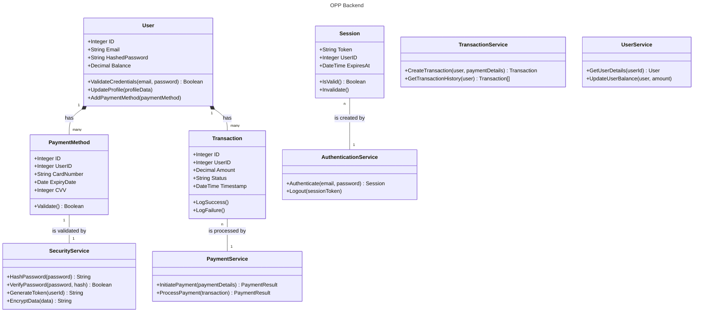

# TrinityGo Online-payment Processing Platform (OPP)
- **Title:** Project ReadMe file
- **Course:** NEU CS5500 Fall 2023
- **Date:** Dec 7, 2023
- **Author:** Yiwen Wang, Xinyi Gao, Yijia Ma
- **Version:** v1.1
- **Public-facing URL**: [Link]

## Introduction
- *This is a course project for NEU CS5500. All the descriptions below is a mock situation for our project with course project requirments.*


Welcome to the repository for our innovative Online Payment Processing Platform (OPP). Our startup(course project), comprising a dedicated team of business development consultants, solutions architects, and software engineers, is on the cutting edge of digital payment solutions. Having secured Series-B funding, we are excited to develop a robust platform designed to facilitate online transactions for consumers and businesses, providing a superior alternative to traditional point-of-sale systems.


Our mission is to deliver a state-of-the-art platform that rivals established services such as PayPal, Square, and Stripe, catering to a diverse clientele that includes software developers and small-to-medium-sized business owners.

- Watch our Demo video: https://youtu.be/UUgq4tRaCn0 

### Objective
The primary goal of this project is to architect and implement the backend infrastructure necessary to support RESTful APIs for our platform. Concurrently, we aim to create a streamlined frontend interface that offers an intuitive user experience.

### Target Users
- **Software Developers:** We offer well-documented REST APIs that are easy to integrate, empowering developers to build seamless payment applications on top of our platform.
- **Business Owners:** Our platform promises a hassle-free transition from traditional POS systems to a user-friendly web application for managing transactions.

### Core Features
Our software system is engineered to support the following functionalities:
- **Processing Transactions:** Securely process credit card charges for customer purchases.
- **Balance Calculations:**
    - Provide real-time calculations of the total balance from fully processed funds.
    - Calculate and report the total balance over specified time periods.
- **Transaction Management:**
    - Retrieve comprehensive lists of all transactions affecting the total balance.
    - Track accounts receivables, including pending purchases.
- **Fraud Detection:** Utilize rigorous validation processes to identify and reject fraudulent credit card transactions.
- **Funds Verification:** Ensure debit cards have sufficient funds before authorizing purchases.
- **Account Management:** Enable users to create and manage their accounts with the platform seamlessly.

### Security & Compliance
Security is not just a feature; it is the foundation of our platform. We are deeply committed to protecting our users and their data through industry-standard practices and compliance with regulatory requirements.

## Encryption Algorithm Explaination
Our encryption algorithm relies on credited online resources and code samples. It's not independently developed.

## V1.1 Updates for BugBash
1. Closed and Explained Issue #74: A better way for user to manage unwanted transactions
    - Our system does not permit users to delete transactions. It is important to maintain the integrity of transaction records, therefore regular users are not granted the privilege to remove transactions. This policy is in place because each processed transaction represents an actual event and should remain unaltered in the system. In the future, we might consider introducing a feature that allows users to hide or unhide transactions for enhanced user experience. However, it's important to note that this would not equate to deletion from the system.
2. Solved Issue #75 Enhance the timely response for card validation
    - The issue stemmed from a delay in the response from the third-party API, responsible for validating card numbers and transaction amounts. This delay led to a misleading user experience, where transactions not actually rejected were temporarily labeled as "rejected." To mitigate this confusion and enhance user experience, we have introduced a new status, "processing," to replace the premature "rejected" label.
3. Solved Issue #76 Simplify time format for user input

## Instructions for use
### Initial Installation
* Create a virtual environment
  * `pip install virtualenv`
  * `virtualenv env`
* Activate the virtual environment
  * on macOS and Linux, use:
    * `source env/bin/activate`
  * on Windows, use:
    * `env\Scripts\activate`
* Install the required' dependencies
  * `pip install -r requirements.txt`
* Open a terminal to the root of the repository and run the following command:
  * `uvicorn backend.main:app --reload`
* Upload `.env` file to root directory

### Post-Installation & Swagger UI
* Open the following URL on a browser of your choice: `http://127.0.0.1:8000/docs`
* Since all the API's are protected, you need to authenticate and authorize yourself
  * create user via `/auth` endpoint
  * authenticate and authorize user via `authorize` button at top right corner
* Tests are working in this environment as well

### Docker
Navigate to the root of this directory

* Build the image: `docker build -t opp-api:v1 .`
* Run the container: `docker run --name payment-service -p 8000:8000 opp-api:v1`
* Stop the container: `docker stop payment-service`
* Restart the container: `docker start payment-service`
* Remove the container: `docker remove payment-service`

### Push New Image to ECR

 On your local machine, build an image from the root of your repo and note the name of the image, make sure the name is unique
```
docker build --platform linux/amd64 -t <name of image> .
```

 Tag the image using the ECR URI
```
docker tag <image> <ECR URI>:<tag>
```

 Login in ECR

 *Following command can be obtained directly from `AWS console > ECR > Repositories > Select your repo > View Push Commands`
```
aws ecr get-login-password --region <REGION> | docker login --username AWS --password-stdin <REPO_HOST>
```

 Push the tagged image to your ECR
```
docker push <ECR URI>:<tag>
```

 Check image existence in repo via AWS console
* If image does not exist, double check if the image name and tag appeared in Docker Desktop matches exactly with what you have provided above
* Check if ECR url is correct

### Pull image from ECR into EC2 instance

SSH into your EC2
```
ssh -i <PRIVATE-KEY-FILE> <EC2-INSTANCE-PUBLIC-DNS>
```
Run `aws configure` and add following user credentials from Access Key created for the `IAM User` with Administrative Access 
```
AWS Access Key ID=<YOUR-USER-ACCESS-KEY>
AWS Secret Access Key=<YOUR-SECRET-ACCESS-KEY>
region=<YOUR-EC2-INSTANCE-REGION>
```
Log into ECR
```
aws ecr get-login-password --region <REGION> | docker login --username AWS --password-stdin <REPO_HOST>
```

If Permission Denied: 
```sudo usermod -a -G docker $USER
grep docker /etc/group
newgrp docker
```
Pull the image from ECR
```
docker pull <ECR URI>:<tag>

eg: docker pull aws_account_id.dkr.ecr.us-east-1.amazonaws.com/opp-app:v1
```
Run the container
```
docker run --name opp-app -p 8000:8000 <ECR URI>:<tag>

eg: docker run --name payment-service -p 8000:8000 aws_account_id.dkr.ecr.us-east-1.amazonaws.com/opp-app:v1
```
Test your endpoint

```
<ec2 public url>:<app port>/docs
```

### Cloud Infrastructure Setup


#### Configure EC2 for Docker

* Create a new EC2 instance (t2 micro-free tier eligible)
* Create a key pair (download and save the keypair to connect to EC2)
* Create security group and allow traffic from internet
* Launch instance
* * Modify the keypair to allow SSH access
```
chmod 400 <path to key pair>  
```
* Connect to instance via SSH
```
ssh -i <path to keypair> ec2-user@ec2-35-86-175-165.us-west-2.compute.amazonaws.com
```
If you can't connect on initial try, try rebooting your EC2 instance and reconnecting.


* Install Docker
```
sudo yum install -y yum-utils
sudo yum install docker
```

Start docker in background
```
sudo systemctl start docker.service
sudo systemctl enable docker.service
```

Add user to docker group so you don't have to use sudo all the time with docker commands

```
sudo groupadd docker
sudo usermod -aG docker $USER
newgrp docker
docker run hello-world
```

#### Create an ECR repo to house your docker images

* Go to ECR in AWS console
* Create a private repo with suffic `opp-app` (Note the ECR URI)

#### Create Admin User on IAM
* Go to IAM in AWS console
* Create a User and give it Administrator Access
* Create an access key and save the file somewhere safe

#### Set up CLI tool
* If you haven't already, install `aws-cli`, run `aws configure`, and add your credentials from the previous step to the aws cli tool

## Design Stage
**Design Documents**
- High Level Design:
    - [HLD_digram]: Diagram of our overall architecture[^1]
    - [Deployment_Pipeline]: Deployment pipeline design
    - [Backend_Module_Description]: Description of each of our backend modules
    - [Wireframes_UI]: Wireframes of our UI
- Low Level Design:
    - [ER_Diagram]: Entity Relationship Diagram of our database[^2] [^3]
    - [API_Sequence_Diagram]: Sequence Diagram of each ReST API[^4]
    - [ReST_API_Design]: ReST API design
    - [Backend_Module_Functional_Logic]: Description of how each backend module performs its job with class UML

### Design Requirements
- Debit Card Transactions: Must be instantly processed, bypassing delays commonly associated with the banking system.
- Credit Card Transactions: Require a minimum of two calendar days in the processing state before reflecting in the total balance as 'processed'.
- Card Validation: Implement the Lund Algorithm for credit card number validation as part of our commitment to security and authenticity.
- Security Measures:
    - Mandatory user authentication to safeguard against unauthorized access.
    - Enforce encryption and other security protocols for data transmission to ensure confidentiality and integrity.

**High Level Design Visualization**
- Architecture

- Wireframes UI


**Low Level Design Visualization**
- ER Diagram:

- API Sequence Diagram:


- Backend Drafted functionality logic Class UML:


**Revision History**
|Date|Version|Description|Author|
|:----:|:----:|:----:|:----:|
|Nov 2, 2023|1.0|Initial release| Yiwen Wang|
|Nov 2, 2023|1.1|Update Diagrams,Hyperlinks for Reference| Yijia Ma|
|Nov 2, 2023|1.2|Update Diagrams, Hyperlinks for Reference|Xinyi Gao, Yiwen Wang|
|Nov 9, 2023|2.0|Create Backend Skeleton and some Public APIs|Xinyi Gao, Yiwen Wang, Yijia Ma|
|Nov 16, 2023|2.0|Add tests and backend|Xinyi Gao, Yiwen Wang, Yijia Ma|
|Nov 30, 2023|2.1|Add container|Xinyi Gao|
|Dec 7, 2023|2.1|Add documentation|Xinyi Gao, Yiwen Wang, Yijia Ma|

## Documentations
- [Authentication_API]: Explain how to obtain and use API keys or token
- [Authorization_API]: Explain how to obtain and use API keys or token
- [Endpoint_API]: Detail the required request parameters, acceptable request methods (GET, POST, PUT, DELETE), and expected response formats
- [Error_API]: Document error status codes and meanings

## Reference
[^1]: Medium, Sriram Srinivasan, Payment Processing Architecture, https://medium.com/@sriram.inc/payment-processing-architecture-9651e7292b0c  
[^2]: Lucidchart, How to Draw an ER Diagram， https://www.lucidchart.com/pages/how-to-draw-ERD 
[^3]: Lucidchart, What is an Entity Relationship Diagram (ERD)?https://www.lucidchart.com/pages/er-diagrams
[^4]: Plantuml, Sequence Diagram, https://plantuml.com/sequence-diagram

<!-- auto references -->
[ReST_API_Design]: https://github.com/TrinityGo/opp-api/blob/main/design-documents/ReST_API_design.md
[HLD_digram]:https://github.com/TrinityGo/opp-api/blob/main/design-documents/HLD.JPG
[Backend_Module_Description]: https://github.com/TrinityGo/opp-api/blob/main/design-documents/Backend_Module_Description.md
[ER_Diagram]:https://github.com/TrinityGo/opp-api/blob/main/design-documents/ER_Diagram_for_Online_Payment_System.jpeg
[Backend_Module_Functional_Logic]:https://github.com/TrinityGo/opp-api/blob/main/design-documents/Backend_Module_Functional_Logic.md
[API_Sequence_Diagram]: https://github.com/TrinityGo/opp-api/tree/main/design-documents/Sequence_Diagram
[Wireframes_UI]: https://github.com/TrinityGo/opp-api/blob/main/design-documents/Wireframes_UI.md
[Deployment_Pipeline]: https://github.com/TrinityGo/opp-api/blob/main/design-documents/Deployment_Pipeline.md
[Authentication_API]: https://github.com/TrinityGo/opp-api/blob/main/doc/authentication_API.md
[Authorization_API]: https://github.com/TrinityGo/opp-api/blob/main/doc/authorization_API.md
[Endpoint_API]: https://github.com/TrinityGo/opp-api/blob/main/doc/endpoint_API.md
[Error_API]: https://github.com/TrinityGo/opp-api/blob/main/doc/error_API.md
[Link]: http://ec2-54-173-190-240.compute-1.amazonaws.com:8000/docs#/
