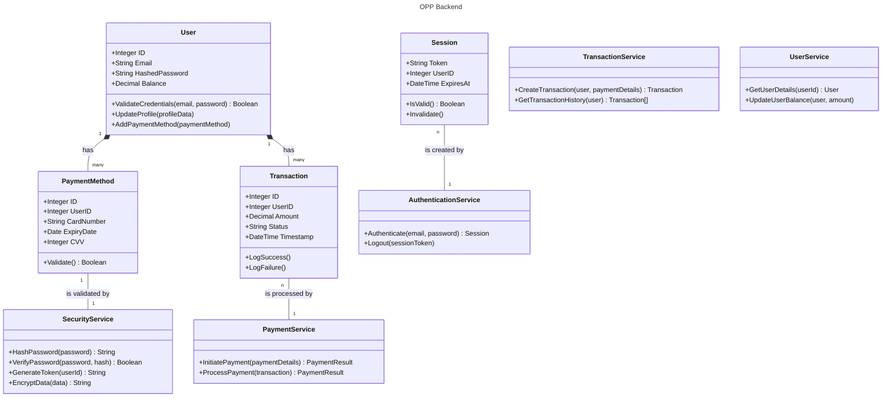

# Functional Logic Descriptions
- **Title:** Low-Level Backend Modules Functional Logic
- **Date:** Nov 2, 2023
- **Author:** Yiwen Wang
- **Version:** 1.1

**Revision History**
|Date|Version|Description|Author|
|:----:|:----:|:----:|:----:|
|Nov 2, 2023|1.0|Initial release| Yiwen Wang|
|Nov 2, 2023|1.1|Class UML updates| Yiwen Wang|
---------------

## 1. User Authentication Module Logic
### Process Flow:
1. User Login:
    - Retrieve user credentials from the request.
    - Query the user service to fetch user details by email.
    - If no user is found, return an authentication error.
    - Use the security service to verify the provided password against the stored hash.
    - If verification fails, return an authentication error.
    - Generate a session token using the security service.
    - Store the session and token in the session database.
2. User Logout:
    - Accept session token from user request.
    - Invalidate the session token in the session database to prevent further use.

### Business Logic:
The authentication module's business logic focuses on ensuring that user credentials are validated securely and that sessions are managed effectively to prevent unauthorized access.

## 2. Payment Processing Module Logic
### Process Flow:
1. Payment Initiation:
    - Validate the incoming payment request for required fields and fraud signals.
    - Retrieve the user's details from the User Account Module.
    - Create a transaction log entry using the Transaction Module.
    - Pass the transaction to the external payment gateway interface.
    - Receive the payment result and determine the success or failure of the transaction.
    - Log the transaction result accordingly.
    - If successful, update the user's balance through the User Account Module.
### Business Logic:
The core logic revolves around validating, processing, and recording payment transactions while interfacing with external services and internal modules to reflect the results accurately.

## 3. Transaction Logging Module Logic
### Process Flow:
1. Transaction Logging:
    - Insert the transaction record into the database with all relevant details.
    - Notify the reporting service of the transaction outcome for auditing purposes.
2. Transaction History Retrieval:
    - On request, query the database for transaction records associated with a user ID.
    - Return the transaction history for presentation to the user or for administrative purposes.
### Business Logic:
This module's business logic ensures that all financial transactions are audited and available for review, supporting accountability and transparency.

## 4. User Account Module Logic
### Process Flow:
1. User Profile Update:
    - Receive new profile data from the user.
    - Update the user's profile in the database service.
2. Payment Method Management:
    - Validate new payment method data.
    - Encrypt payment data using the security service.
    - Store encrypted payment data in the database.
3. Account Balance Management:
    - Upon a successful transaction, calculate the new balance.
    - Update the user's balance in the database.
### Business Logic:
The business logic for this module deals with maintaining user profiles, securing payment methods, and keeping accurate records of account balances.

## Class UML
